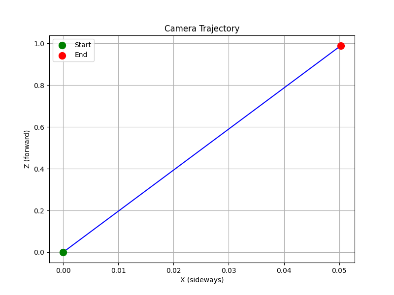

# Visual Odometry Benchmark

A research-oriented implementation of classical Visual Odometry (VO)
using ORB feature detection and matching, built from scratch in Python and OpenCV.

## Demo


## Scope
This project estimates camera motion from a sequence of images — the
core problem in robotics, autonomous vehicles, and AR/VR systems.

## Pipeline
1. **Feature Detection** — ORB keypoints extracted from each frame
2. **Feature Matching** — Brute-force matching with distance filtering
3. **Pose Estimation** — Essential matrix + camera pose recovery
4. **Trajectory Plotting** — Visualizing camera path over time

## Tech Stack
- Python 3.11
- OpenCV
- NumPy
- Matplotlib

## Setup
```bash
git clone https://github.com/MadhavanCs/cv-robotics-vo-benchmark.git
cd cv-robotics-vo-benchmark
python -m venv venv
source venv/Scripts/activate
pip install -r requirements.txt
```

## Run
```bash
# Feature detection
py src/vo/orb_features.py

# Feature matching
py src/vo/orb_matching.py

# Pose estimation
py src/vo/pose_estimation.py

# Trajectory
py src/vo/trajectory.py
```

## Results
| Metric | Value |
|--------|-------|
| Feature detector | ORB |
| Matcher | Brute Force + Hamming |
| Good matches (sample) | 323 |
| Pose estimation | Essential Matrix + RANSAC |

## Dataset
Currently tested on custom images.
Next: TUM RGB-D Dataset integration.

## References
- Mur-Artal et al., ORB-SLAM (2015)
- OpenCV Visual Odometry docs
